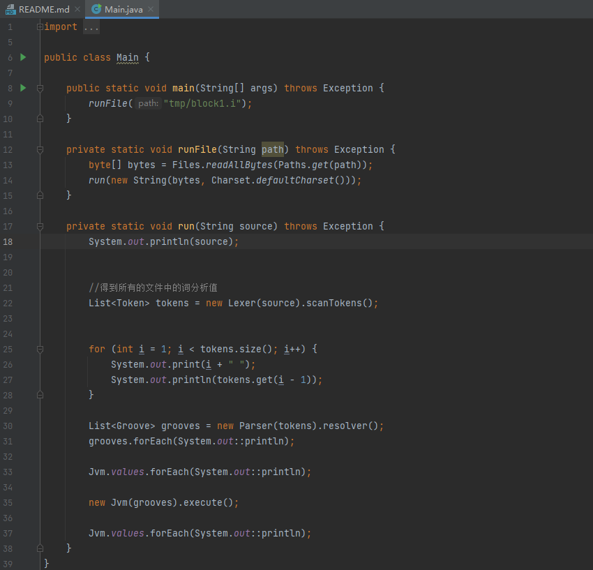
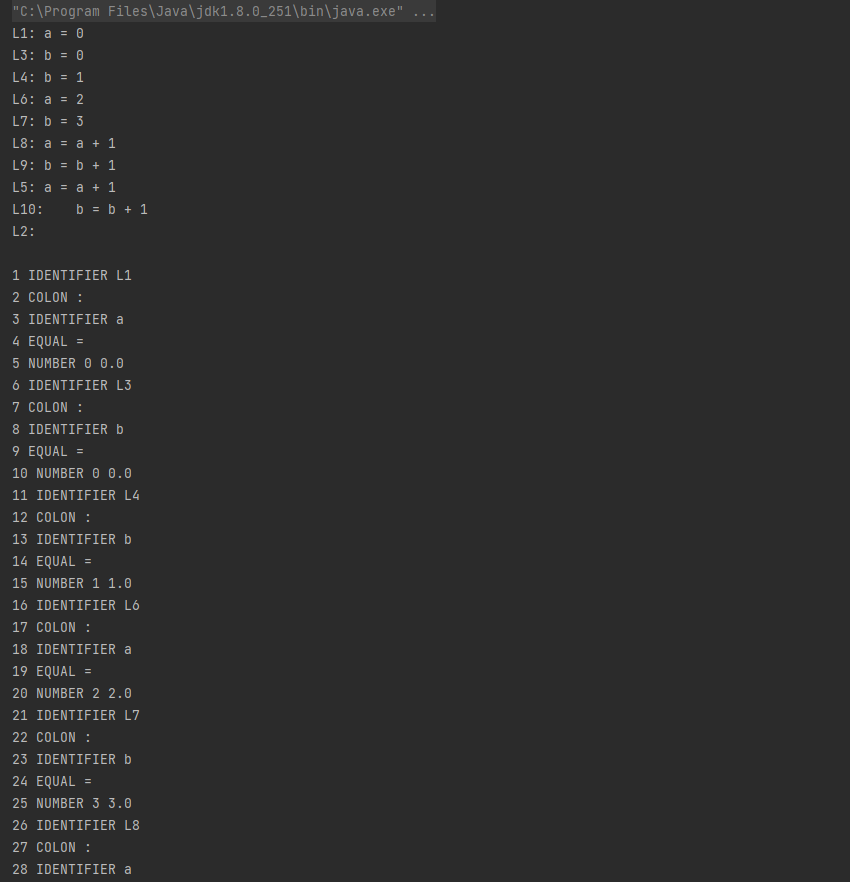

<h1 align="center">编译解释器</h1>

- 完整代码获取地址：从戎源码网 ([https://armycodes.com/](https://armycodes.com/))
- 作者微信：19941326836  QQ：952045282 
- 承接计算机毕业设计、Java毕业设计、Python毕业设计、深度学习、机器学习
- 选题+开题报告+任务书+程序定制+安装调试+论文+答辩ppt 一条龙服务
- 所有选题地址（https://github.com/YuLin-Coder/AllProjectCatalog）
>
>
 
一、需求分析

 
以编译原理书中最后一项作业，根据前端生成的中间代码来编写后端解释器，其中间代码标示了每行的行号，同时还包含了赋值语句、跳转语句、二位运算表达式的四则运算，条件语句跳转，列表类型的值获取等等，对于这个简单的中间代码执行程序，可以很简单的根据每行定义一个槽列表，方便跳转语句。主要的值类型可分为整型，布尔类型，我使用Object类型的列表存入，用instance判断其类型，从而转换，语法分析器中读入词法列表，根据每个槽生成槽内的字节码列表，槽对应行号和字节码列表。

 
二、可行性分析

  
 
上文中我使用槽代表每行应该执行的语句，后面我定义了一部分字节码，整个流程是以编译成字节码后执行的，对于字节码和语句树的方式，前者更加方便操作（对于列表的前进后退等等），更能完好的控制流程跳转。
 最后使用虚拟机的方式遍历执行字节码，虚拟机参考Python的执行方式，虚拟机内有两个值列表，一个存入当前作用域内执行的值，一个HashMap存入变量，对应执行列表中的某个位置。

 
 
 
三、总体设计

 
1.   首先主程序读入文件，转换成字符串。

 
2.   传入词法分析器，生成特定的词法列表。

 
3.   传入语法分析器，生成槽列表（字节码列表）。

 
4.   槽列表传入虚拟机，遍历执行。

 
5.   得到执行完成的两个列表，运行内列表和变量哈希列表，输出。

## 环境

- <b>IntelliJ IDEA 2009.3</b>

- <b>Mysql 5.7.26</b>

- <b>Tomcat 7.0.73</b>

- <b>JDK 1.8</b>

## 运行截图

